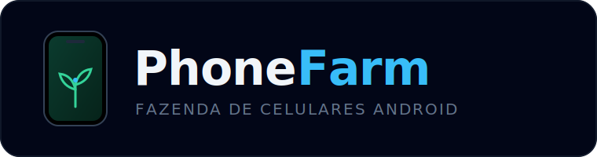

<p align="center">
  
</p>

<p align="center">
  Fazenda de celulares Android local — emuladores via UI, espelho ao vivo e controle total.
</p>

---

**Phone Farm** transforma sua máquina numa **fazenda de celulares Android** para QA e
automação. Cada "celular" é um **emulador Android (AVD)** rodando localmente — criado,
iniciado e parado direto pela interface — ou um device físico via **USB** (mesmo
pipeline `adb`). A **grade espelha a tela real** de cada device ao vivo; ao **expandir**,
você controla por **toque, arraste e long-press**, além de teclas (Home/Back/Power/
Volume), rotação, digitação, abertura de URL, **instalação de APK** (em lote) e
**gravação de tela**.

Stack: **React + Vite + Tailwind** no front; **Node + Express + WebSocket** no back, com
streaming **MJPEG** leve (downscale via `sharp`). Sem o SDK Android instalado, roda em
modo **mock** para desenvolvimento da UI.

> Painel de QA/testes/automação **próprios** — não destinado a fraude, multi-conta ou
> burla de Termos de Serviço de apps. Arquitetura e decisões em [`PLANO.md`](./PLANO.md).

> 🏁 **v0.1 — primeira versão funcional.** Cada "celular" é um **emulador Android (AVD)**
> rodando na mesma máquina (device USB também funciona). Sobe/derruba pela UI, a grade
> **espelha a tela real** ao vivo, e o modal dá **controle total** (toque, teclas, APK,
> gravação). Sem SDK/adb, cai em **mock**. Próximo: empacotar p/ instalar em outras máquinas.
>
> **Interação:** grade = espelho (só visual); **duplo-clique** ou ⤢ expande; modal =
> toque/arraste/long-press + Back/Home/Power/Vol/Girar/URL/texto/APK/gravar. Lista = animação leve.

## Pré-requisitos p/ emuladores locais

- **Android SDK** (Android Studio já basta) com `emulator`, `platform-tools`, `cmdline-tools`.
- `ANDROID_HOME` (ou `ANDROID_SDK_ROOT`) apontando p/ o SDK.
- Pelo menos 1 **system-image** + 1 AVD (crie no Android Studio ou via "+ Provisionar").
- Virtualização ligada (WHPX no Windows / KVM no Linux) p/ emulador acelerado.

## Rodar

### Produção — 1 processo só (recomendado)

O backend serve o frontend buildado (`dist/`) + API + WebSocket na **mesma porta**.

```bash
npm install               # deps do front
cd server && npm install  # deps do back
cd .. && npm start         # build do front + sobe o backend → http://localhost:4000
```

Já buildado, é só `npm run serve` (backend serve o `dist/` existente).
Force a fonte: `FORCE_MOCK=1` (mock) ou `FORCE_ADB=1` (adb) antes do comando.

### Dev — 2 processos (hot reload)

```bash
# terminal 1 — backend (porta 4000)
cd server && npm install && npm run dev

# terminal 2 — frontend (porta 5173, proxia /api e /ws p/ o backend)
npm install && npm run dev
```

## Stack

- **Frontend:** Vite 5 + React 18 + Tailwind 3.4 (Node 18 compatível)
- **Backend:** Node + Express (REST) + ws (WebSocket de estado ao vivo)
- **Device source:** `adb` real (USB/WiFi/redroid) com fallback mock automático

### API do backend
| Método | Rota | O quê |
|---|---|---|
| GET | `/api/health` | status + fonte |
| GET | `/api/devices` | lista de devices |
| POST | `/api/suite` | roda suite (body `{ids}`; vazio = todos) |
| POST | `/api/devices/:id/action` | keyevent (`back\|home\|recents\|power`) |
| GET | `/api/devices/:id/screenshot` | PNG real via `adb screencap` (204 no mock) |
| GET | `/api/devices/:id/stream?fps=&w=&q=` | stream MJPEG ao vivo; `w`=largura (downscale), `q`=qualidade |
| POST | `/api/devices/:id/tap` | toque (`{x,y}` em coords reais do device) |
| POST | `/api/devices/:id/swipe` | arraste (`{x1,y1,x2,y2,ms}`) |
| POST | `/api/devices/:id/text` | digita texto (`{text}`) |
| POST | `/api/devices/:id/openurl` | abre URL no device (`{url}` → `am start VIEW`) |
| POST | `/api/devices/:id/rotate` | gira a tela (`{deg}` 0/90/180/270) |
| GET | `/api/images` | system-images instaladas + perfis de device (p/ provisionar) |
| POST | `/api/uploads` | sobe APK 1× (multipart `apk`) → `{token}` p/ reusar |
| POST | `/api/devices/:id/install` | instala APK por `{token}` (`adb install -r -g`) |
| GET | `/api/devices/:id/record?seconds=` | grava a tela e baixa o `.mp4` (`screenrecord`) |
| POST | `/api/provision` | (frontend) cria + sobe um AVD novo |
| GET | `/api/emulators` | lista AVDs e quais estão rodando |
| POST | `/api/emulators/:name/start` | sobe o AVD (headless, porta 555X) |
| POST | `/api/emulators/:name/stop` | derruba o AVD |
| POST | `/api/emulators` | cria AVD (`{name}`) e já sobe |
| WS | `/ws` | push da lista a cada mudança |

### Fluxo emulador
1. Backend detecta o SDK → habilita emuladores locais.
2. UI lista os AVDs na barra **Emuladores (AVD)**; clique ▶ p/ subir.
3. O emulador sobe headless, o `adb` o detecta, e ele aparece na grade.
4. Modal: Back/Home/Recents/Power (keyevent adb), **Shot** (screencap real), **Parar emulador**.

## Estrutura

```
src/                     # frontend
  main.jsx               # entrypoint React
  App.jsx                # orquestrador: filtros, suite, layout (usa useDevices)
  index.css              # Tailwind + keyframes (scanline)
  api/client.js          # REST + WebSocket client (devices + emuladores)
  hooks/useDevices.js    # estado ao vivo (fetch inicial + WS com reconnect)
  data/mock.js           # OSES + maps de status/teste (constantes de UI)
  components/
    FakeScreen.jsx       # tela animada (placeholder do stream contínuo)
    PhoneCard.jsx        # device no modo grade
    PhoneRow.jsx         # device no modo lista (denso)
    FocusModal.jsx       # zoom + AO VIVO + toque + Back/Home/Power/Vol/Girar/URL/texto
    LiveScreen.jsx       # stream MJPEG () + tap / long-press / swipe
    EmulatorBar.jsx      # barra de AVDs locais (start/stop)
    ProvisionModal.jsx   # criar AVD: nome + versão Android + perfil de device

server/                  # backend
  src/index.js           # Express + WS bootstrap + rotas (devices/emulador/stream/tap)
  src/manager.js         # DeviceManager: poll, merge status de teste, reconcilia emuladores
  src/emulators.js       # EmulatorManager: list/start/stop/create de AVDs locais
  src/stream.js          # MJPEG (multipart/x-mixed-replace) a partir do screencap
  src/frame.js           # downscale via sharp (PNG cheio → JPEG redimensionado)
  # APK: /api/uploads (multer) → /install por token; gravação: /record (screenrecord)
  src/devices/
    index.js             # chooseSource (adb quando disponível, senão mock)
    adbSource.js         # adb real — list/screenshot/input/tap/swipe/text (emulador + USB)
    mockSource.js        # fallback fake (sem SDK/adb)
```

## Funcionalidades (protótipo)

- Grade ajustável (4–7 col) **e** lista densa (escala p/ 10–50 telas)
- Status por device: online / booting / offline
- Status de teste: idle / running / pass / fail + contadores no header
- Filtros (status, tipo, versão Android) e **agrupar por OS**
- Multi-seleção + ações em lote (APK, limpar dados, screenshot, reiniciar)
- "Rodar suite" (simulado) e foco/zoom

## Próximos passos

Ver fases em `PLANO.md`. Imediato:
1. Trocar `src/data/mock.js` por client de API (REST/WS).
2. Fase 1: integrar `ws-scrcpy` p/ tela real de 1 Android no `FakeScreen`.
3. Fase 2: subir `redroid` em Docker e conectar N telas.

## Protótipo standalone

`prototype/index.html` — versão single-file (React+Tailwind via CDN), abre num
server estático qualquer. Mantida só como referência rápida; o app real é este scaffold.
